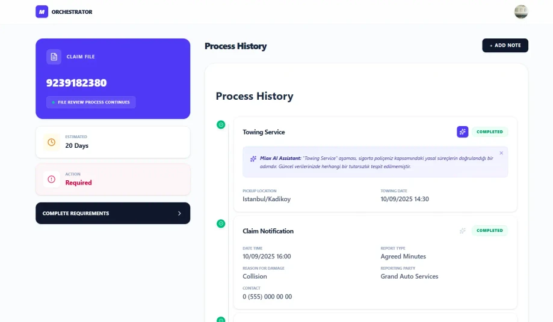

# claim-orchestrator-app

Modern React Stack • Tailwind CSS v4 • TypeScript • Zustand • Registry Pattern App

---

[See The Project](https://claimorchestratorapp.netlify.app/)

---



---

Modern sigorta hasar takip süreçlerini; proaktif, kullanıcı etkileşimli ve yapay zeka destekli bir deneyime dönüştüren, yüksek performanslı bir **Dijital Hasar Yönetim Paneli** çalışmasıdır. Proje, karmaşık süreç verilerinin (heterogeneous data) yönetimi ve dinamik arayüz gereksinimleri için ölçeklenebilir mimari standartlar üzerine inşa edilmiştir.

### 🚀 Özellikler

- **Polymorphic UI (Registry Pattern):** Uygulama, birbirinden tamamen farklı veri alanlarına sahip süreç adımlarını (Towing, Appraisal, Payment vb.) spagetti kod (`if/else`) yerine, ölçeklenebilir ve merkezi bir **Component Registry** mimarisiyle yönetir.
- **AI Agent Integration:**
  - **Contextual Assistant:** Her bir süreç adımı için o adıma özel, simüle edilmiş yapay zeka açıklamaları ve içgörüleri sunar.
  - **AI Document Analyzer:** Kullanıcıların yüklediği belgeleri (Örn: Mesleki Sertifika) simüle edilmiş bir AI nodu üzerinden valide eder ve süreç statüsünü otomatik olarak günceller.
- **Dinamik Süreç Yönetimi (Zustand):** Kullanıcıların süreç akışı arasına dinamik olarak yeni notlar eklemesine veya mevcut dinamik öğeleri sistemden kaldırmasına olanak tanıyan tam kontrollü state yönetimi.
- **3-Second Rule (Actionability):** Kullanıcının "Dosya durumum nedir?", "Süreç ne kadar sürecek?" ve "Şu an ne yapmalıyım?" sorularına, proaktif bir Sidebar tasarımıyla ilk 3 saniyede cevap veren kullanıcı deneyimi (UX).
- **Modern UI Standartları:** Tailwind CSS v4'ün yeni CSS-first motoru kullanılarak; Refined Squircle (dengeli yuvarlatılmış köşeler), mikro-interaktif hover efektleri ve tam responsive (Mobile First) bir arayüz tasarlanmıştır.
- **Tip Güvenliği ve Doğrulama:** Tüm süreç verileri **Zod** ile şemalandırılmış ve TypeScript'in `Discriminated Unions` özellikleri kullanılarak çalışma zamanı (runtime) hataları minimize edilmiştir.

### 🛠️ Teknoloji Yığını

- **Framework:** React + Vite
- **Language:** TypeScript (Strict Mode)
- **State Management:** Zustand (Immutable State Operations)
- **Data Validation:** Zod (Discriminated Union Pattern)
- **Styling:** Tailwind CSS v4
- **Icons:** Lucide React
- **Data Fetching:** TanStack React Query (Mock Simulation)

### 📋 Kurulum ve Çalıştırma

```bash
# Projeyi klonlayın
git clone https://github.com/alperenkursun/claim-orchestrator-app.git

# Proje klasörüne gidin
cd claim-orchestrator-app

# Gerekli paketleri yükleyin
npm install

# Uygulamayı başlatın (Development Server)
npm run dev
```

### 🧠 Teknik Kararlar ve Mimari Notlar

- **Neden Registry Pattern?** Süreç adımları (nodes) her sigorta tipi için genişleyebilir bir yapıdadır. Bu mimari sayesinde sisteme yeni bir adım tipi eklendiğinde ana bileşene dokunmadan sadece bir bileşen oluşturup kayıt (registry) objesine eklemek yeterlidir (SOLID Open/Closed Principle).
- **Derived State Yönetimi:** Sidebar üzerindeki "Aksiyon Gerekiyor" durumu gibi veriler, ana veriden türetilerek (derived state) yönetilmiş, böylece gereksiz `useEffect` kullanımından kaçınılarak render performansı optimize edilmiştir.
- **Zustand Kullanımı:** Uygulamanın genelinde karmaşık iç içe geçmiş nesne güncellemeleri (nested object updates) yerine, Zustand üzerinden immutable ve temiz bir veri akışı tercih edilmiştir.
- **UX & Responsiveness:** Desktop'ta grid/sidebar hiyerarşisi, mobilde ise akışkan bir timeline yapısı kurgulanarak bilgi hiyerarşisi her ekran boyutunda korunmuştur.

### 🤖 Kullanılan AI Araçları

Bu projenin geliştirme sürecinde mimari yapılandırmayı doğrulamak, boilerplate kod yazımını hızlandırmak ve karmaşık TypeScript tip tanımlamalarını optimize etmek amacıyla Google AI ekosisteminden yararlanılmıştır.

---

[GitHub Profile](https://github.com/alperenkursun)